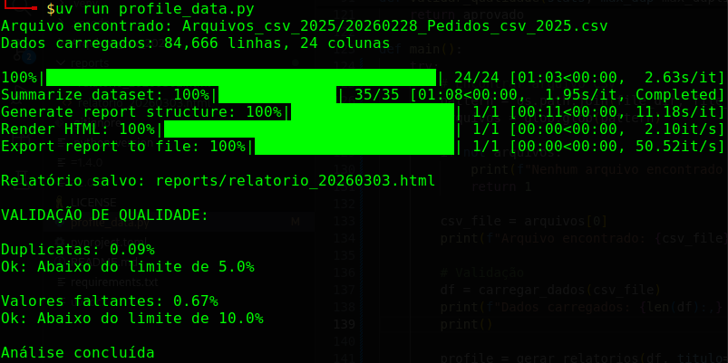
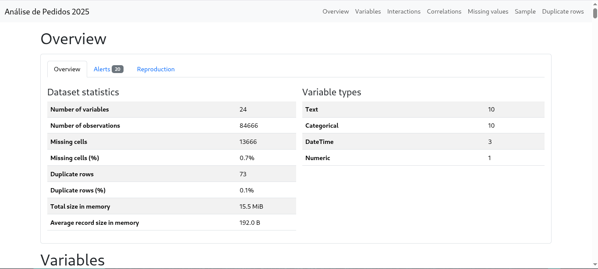

# Data Profiler Pipeline

Validação automatizada de qualidade de dados para pipelines ETL usando ydata-profiling.


## Visão Geral

Valide a qualidade dos dados antes de carregá-los em bancos de dados. Esta ferramenta gera relatórios HTML abrangentes com profiling automatizado, verificações de qualidade e visualizações interativas.

Desenvolvido para estudar a estrutura dos dados antes de qualquer tratamento.

## Funcionalidades

- Profiling automatizado de dados com ydata-profiling
- Validação de qualidade (duplicatas, valores faltantes)
- Relatórios HTML interativos com 7 abas de análise
- Suporte para múltiplos encodings e separadores
- Thresholds de qualidade configuráveis
- Compatível com mudanças na API do ydata-profiling (4.6+)

## Instalação

### Pré-requisitos

- Python 3.12 (3.13 ainda não suportado)
- Gerenciador de pacotes UV (recomendado) ou pip

*Achar a versão certa foi muito estressante, consulte o requirements.txt*

### Configuração
```bash
# Clonar repositório
git clone https://github.com/yurivski/data-profiler-pipeline.git
cd data-profiler-pipeline

# Usando UV (recomendado)
uv venv --python 3.11
uv sync

# Ou usando pip
python3.11 -m venv venv
source venv/bin/activate  # Linux/Mac
# venv\Scripts\activate   # Windows
pip install -r requirements.txt
```

## Início Rápido

### 1. Configurar

Edite a seção de configuração em `profile_data.py`:
```python
# Diretório e padrão do arquivo
file_dir = 'Arquivos_csv_2025'
file_pattern = "20260228_Pedidos_csv_2025.csv"

# Thresholds de qualidade
max_duplicates_pct = 5.0   # máximo de duplicatas permitido (%)
max_missing_pct = 10.0     # máximo de valores faltantes permitido (%)
```

### 2. Executar
```bash
uv run profile_data.py
```

### 3. Visualizar Relatório

Abra o relatório HTML gerado no diretório `reports/`.

## Exemplo de Uso

### Saída do Terminal



O script fornece feedback em tempo real durante a execução:
- Progresso de carregamento do arquivo
- Dimensões dos dados
- Status de geração do relatório
- Resultados da validação de qualidade

### Relatório Gerado



O relatório HTML inclui 7 abas interativas:
- **Overview**: Estatísticas do dataset e tipos de variáveis
- **Alerts**: Alertas automáticos de qualidade
- **Variables**: Análise detalhada por coluna
- **Interactions**: Gráficos de dispersão entre variáveis
- **Correlations**: Matriz de correlação
- **Missing values**: Padrões de dados faltantes
- **Sample**: Preview dos dados reais

## Configuração

### Encoding e Separador do CSV

No CSV que usei para exemplo a configuração padrão trata arquivos codificados em UTF-16 com separador ponto e vírgula:
```python
def carregar_dados(caminho):
    df = pd.read_csv(
        caminho,
        sep=';',               # alterar para vírgula se necessário
        encoding='utf-16',     # alterar para UTF-8 se necessário
        engine='python',
        on_bad_lines='skip'
    )
    return df
```

Para arquivos CSV padrão (UTF-8, separados por vírgula):
```python
def carregar_dados(caminho):
    df = pd.read_csv(caminho)
    return df
```

### Modo de Relatório

Escolha entre validação rápida ou análise completa:
```python
# Modo rápido (validação em pipeline)
profile = ProfileReport(df, minimal=True)

# Modo completo (análise exploratória)
profile = ProfileReport(df, minimal=False) # Mais lento
```

### Thresholds de Qualidade

Ajuste os critérios de validação conforme suas necessidades:
```python
max_duplicates_pct = 5.0   # falha se >5% de duplicatas
max_missing_pct = 10.0     # falha se >10% de valores faltantes
```

## Exemplo Real

### Dataset

- **Fonte**: Dados Abertos - LAI (Lei de Acesso à Informação) - Pedidos e Recursos/Reclamações.
- **Tamanho**: 84.666 linhas, 24 colunas
- **Formato**: Codificado em UTF-16, separado por ponto e vírgula
- **Tempo de processamento**: 45 segundos (modo completo)

### Resultados
```
Estatísticas do Dataset:
- Total de linhas: 84.666
- Total de colunas: 24
- Células faltantes: 0,7%
- Duplicatas: 0%
- Uso de memória: 15,5 MiB

Validação de Qualidade:
- Duplicatas: 0,00% (limite: 5,0%)
- Valores faltantes: 0,70% (limite: 10,0%)
- Análise concluída
```

### Alertas Detectados

- Coluna "Situacao" tem valor constante "Concluida"
- Coluna "IdSolicitante" tem 18,4% de zeros

## Estrutura do Projeto
```
data-profiler-pipeline/
├── profile_data.py     # Script principal
├── pyproject.toml    # Dependências do projeto (UV)
├── requirements.txt    # Dependências (pip)
├── .python-version    # Versão do Python (3.11)
├── .gitignore 
├── LICENSE 
├── README.md 
└── reports/    # Relatórios HTML gerados
    └── .gitkeep
```

## Compatibilidade da API

Este script lida com mudanças na API do ydata-profiling entre versões:

- **Versões 4.6-4.17**: `get_description()` retorna dict
- **Versões 4.18+**: `get_description()` retorna objeto BaseDescription

A função `extrair_estatisticas()` detecta e trata ambos os casos automaticamente.

## Solução de Problemas

### Compatibilidade com Python 3.13

ydata-profiling 4.18.1 tem problemas com Python 3.13 talvez por ser uma versão muito nova (se bem que esse número é amaldiçoado de todo jeito)

**Solução**: Use Python 3.11 ou 3.12
```bash
uv venv --python 3.11
```

### Erros de Decodificação Unicode

Se encontrar `UnicodeDecodeError`, o encoding do arquivo pode ser diferente.

**Solução**: Tente diferentes encodings
```python
# Tentar latin-1
df = pd.read_csv(caminho, encoding='latin-1')

# Tentar cp1252
df = pd.read_csv(caminho, encoding='cp1252')
```

### Erros de Parser

Se aparecer `ParserError: Expected X fields, saw Y`, o separador pode estar errado.

**Solução**: Verifique o separador
```python
# Tentar vírgula
df = pd.read_csv(caminho, sep=',')

# Tentar tabulação
df = pd.read_csv(caminho, sep='\t')
```

## Dependências

Dependências principais:
```
pandas>=2.0.0,<3.0
ydata-profiling>=4.6.0
setuptools==65.5.0
```

Veja `pyproject.toml` ou `requirements.txt` para lista completa.

## Casos de Uso

Estudar o arquivo antes de escrever um pipeline, evita frustrações.

## Licença

Licença MIT

## Autor

**Yuri Pontes**  

- [LinkedIn](https://linkedin.com/in/yuri-pontes-4ba24a345)
- [GitHub](https://github.com/yurivski)

---